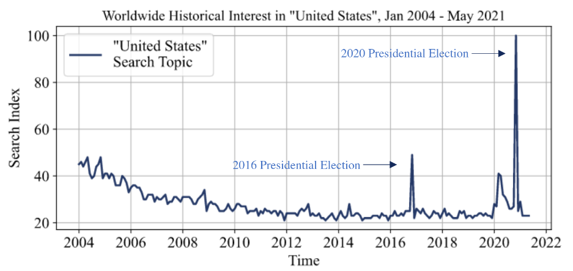

# Global Interest in the 2020 U.S. Election

<div align="center">
    
</div>

<p align="center">
  <a>
    
  </a> 
  <a>
    
  </a> 
  <a>
    
  </a>
  <a>
    
  </a> 
</p>


## Table of Contents
- [Description](#Description)
- [Installation](#Installation)
- [Usage](#Usage)

## Description

This is a data science project tracking global interest in US-related topics through Google Trends. The scripts collect and analyze data from various sources, including online webpages and an unofficial Google Trends API. The data is stored in .csv tables. I visualized the data in a Jupyter Notebook and produced a 25-page research paper for a university course (the course did not involve coding - the scripts I wrote helped me gather the data necessary to write the paper).

## Installation

The project requires no specific installation, though it does require that certain python dependencies be installed. 

The project was written on a 64-bit [MacOS 11 Big Sur](https://apps.apple.com/us/app/macos-big-sur/id1526878132?mt=12) using [Python 3.8.10](https://www.python.org/downloads/release/python-3810/). It uses a few external dependencies, including pandas, numpy, and third-party apis.

To download all python dependencies with pip, type in the command line:
```bash
$ pip install -r requirements.txt
```

## Usage

I do not recommend running the scripts now. The scraped websites and APIS used might be outdated or deprecated. Moreover, the data collected would be different, since it collects data up to the present day. It is better to view the research by reading the paper. 

Nevertheless, to run the scripts, just run them through a python interpreter. 
```bash
python3 scripts/country_table_creator.py
python3 scripts/hourly_df_creator.py
python3 scripts/minthly_df_creator.py
python3 scripts/sattistical_additions.py
```
The scripts will then save the found data in the .csv files in tables. 

To visualize the data, open visualizations/grapher.ipynb in a Jupyter Notebook reader. 
=======
Hi! This is my sample project in my application to the Recurse Center. 

In this project, I amass a large amount of data, mostly taken from Google Trends through an unofficial API, and generate some cool visualizations. The goal was to show the unprecedented search traffic for the 2020 presidential elections, collecting global data and analyzing individual countries, and explore some trends in global search traffic. I originally created this project in May 2021 for a university paper, but it was a class on Foreign Policy, and coding was not expected! I mostly used the class as an excuse to embark on a fun, challenging programming project.

I think this is a good sample project because it shows strong familiarity with Python and the ability to juggle different libraries (e.g. pandas, matplotlib) and APIs (e.g. the wbgapi API that provides economic data from the World Bank).

I originally published my code in this other repository. Since then, I've cleaned up the code to make it more readable. I will now describe the contents of each table:

 - country_table.csv: a table with (almost) all UN member states, including their name, alpha 2 & 3 codes, G20 membership, and other statistical factors like 2019 GDP per capita in USD
 - monthly_df.csv: a table with almost all UN member states and their search traffic over time for the "United States" topic.
 - hourly_df.csv: a one-column table with global hourly traffic for "United States" during a two-week period surrounding the election.

I will now describe the content of each script:

 - grapher.ipynb: the file that generates all the visualizations. All cells can only be run if the other three tables have already been generated.
 - country_table_creator.py: the first file that assembles country_table.csv.
 - statistical_additions.py: the second file that assembles country_table.csv. It cannot be executed before country_table_creator.py has run.
 - monthly_df_reator.py: assembles monthly_df.csv.
 - hourly_df_creator.py: assembles hourly_df.csv.

Lastly, the Jones_Final_Paper.pdf is the final paper I wrote. I made sure to have the visualizations' font and general aesthetic match those of the Word file.

Thank you for reviewing this! 
>>>>>>> bf0db4c004e6da0b3fb6c7e47863c221113037b7
